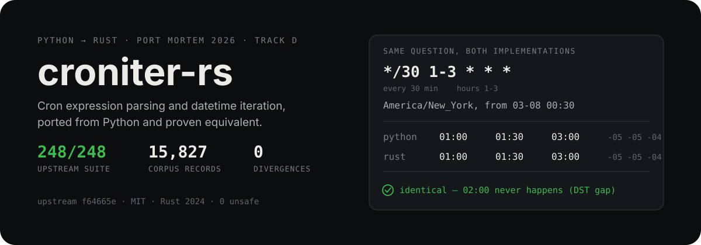
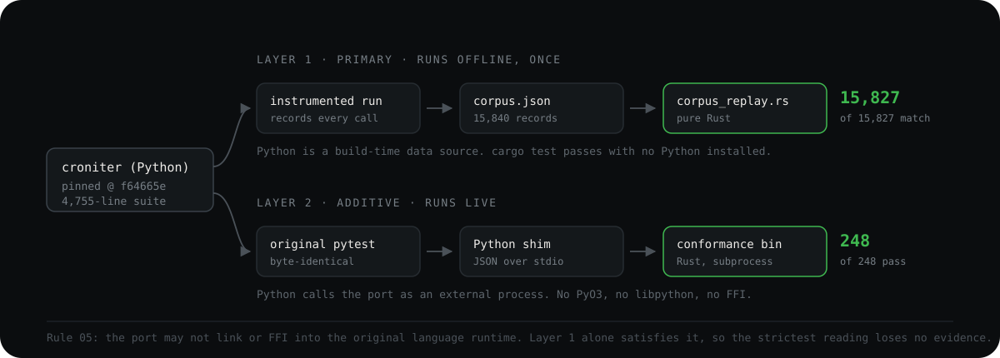

<p align="center">
  
</p>

<p align="center">
  <a href="https://github.com/moneytosms/croniter-rs/actions/workflows/ci.yml"></a>
  
  
  
  
</p>

`croniter-rs` answers one question: given a cron expression and an instant, when does it
next fire, and when did it last fire. It is a Rust port of
[`pallets-eco/croniter`](https://github.com/pallets-eco/croniter), pinned at commit
`f64665e`, built for [Port Mortem 2026](https://coderesurrection.com/2026/), Track D
(Python to Rust).

## Why this repository

croniter is a good port target for three reasons.

It is load-bearing. A lot of Python schedulers depend on it to decide when work runs, so
being subtly wrong is expensive and quiet rather than loud.

Its behaviour is unusually well pinned. 1,586 lines of library carry a 4,755-line test
suite, which is exactly the ratio a behavioural-equivalence port wants: the specification
is executable.

Its interesting parts are the accidents. Fifteen years of accumulated edge cases sit in
it, including daylight-saving folds and gaps, the vixie-cron day-of-month/day-of-week
union bug, `L`, `W` and `#` syntax, and hash-scheduled expressions. A naive rewrite gets
these wrong silently. This port reproduces them rather than correcting them, and every
place it knowingly differs is written up in [`DECISIONS.md`](./DECISIONS.md).

## Evidence

| Evidence | Result |
| --- | --- |
| Original Python test suite, unmodified, run live against the port | **248 / 248** plus 92 subtests |
| Golden-corpus equivalence, replayed in pure Rust | **15,827 / 15,827** (100.00%) |
| Differential fuzzing against the pinned Python | **0 divergences** in 14,610 logged cases |
| Property tests, independent of Python | **4,400 generated cases** |
| Rust tests (unit, property, regression, corpus replay, upstream issues) | **85** |
| `unsafe` blocks | **0** |
| `unwrap`, `panic!` or `unreachable!` in library code | **0** |

Every row is re-checked by [CI](./.github/workflows/ci.yml) on every push.

## Build and test

```sh
make build   # cargo build --release, pinned toolchain, no Python required
make test    # unit, property and regression tests, plus the golden-corpus replay
```

`make test` is the one that must be green, and it needs nothing but Rust. The golden
corpus is committed data, so behavioural equivalence is checked with no Python on the
machine.

With nothing installed but Docker, this builds the port and runs the original Python
suite against it:

```sh
docker build -t croniter-rs . && docker run --rm croniter-rs
```

<details>
<summary>Everything else the Makefile does</summary>

```sh
make test-original   # the original Python suite, live, against the port
make demo            # scripted walkthrough, every figure computed live
make bench-compare   # regenerate bench/results.json
make fuzz            # differential fuzz against the pinned Python
make corpus          # regenerate the golden corpus
```

`corpus`, `fuzz` and `bench-compare` each fetch the pinned upstream commit into a
gitignored scratch directory if it is not already present.

</details>

## How equivalence is proven

Rule 05 forbids the port linking or FFI-ing into the Python runtime, so there is no PyO3
here and no embedded interpreter. Correctness is established along two independent paths,
either of which stands on its own.

<p align="center">
  
</p>

**Golden corpus (primary).** `tools/extract_corpus/` runs the original suite once,
offline, under instrumentation that records every call it makes, including the
expression, start instant, timezone and every constructor keyword, together with what
Python returned or raised. `tests/corpus_replay.rs` replays that in pure Rust.

> Of the 15,840 records extracted, 13 are excluded by name and reported separately by the
> test rather than quietly counted as passes. Ten use croniter's `R` random syntax and
> have no stable answer to check against (DECISIONS 12). Three are calls the Rust API
> cannot express at all: a bad `ret_type`, a `dict` as `hash_id`, and mismatched
> `croniter_range` bound types (DECISIONS 15).

**Conformance bridge (secondary).** `tools/bridge/croniter/` is a pure-Python shim that
satisfies `import croniter` and forwards each call to a long-lived `croniter-conformance`
subprocess over line-delimited JSON. Python calls the port as an external process; the
port contains no Python. See [`DECISIONS.md`](./DECISIONS.md) entry 1.

> This required a handle protocol. The shim parses once in `__init__` and the engine
> holds that parse for the object's lifetime, because croniter draws an `R` expression's
> random values during construction and reuses them. Re-expanding per call made
> consecutive `get_next()` calls wander instead of advance (DECISIONS 16).

**Differential fuzzing (continuous).** `fuzz/harness.py` generates random expressions,
start instants and DST-boundary cases, then runs each against both implementations. The
committed log is the seed-11 run: **14,610 cases, 0 divergences**. CI runs a fresh seed
on every push and fails the build on any divergence.

**Property tests (independent).** The three checks above all measure agreement with
Python, which says nothing about a bug both share. `tests/properties.rs` asserts what a
cron iterator must satisfy on its own terms: `next` advances and lands on a fire, skips
nothing, round-trips through `prev`, and a long walk never stalls. Eleven properties at
400 generated cases each, so **4,400 cases** in total (DECISIONS 18).

`tests/original/` is a verbatim copy of the upstream suite. `HASHES.txt` carries per-file
SHA-256 and `.port-mortem.toml` records the aggregate. Nothing in it was edited, and CI
verifies both the per-file hashes and the manifest on every push.

## A divergence that was not ours

Differential fuzzing found `get_prev` for `*/13 14-15 2-13 6 1` in `Australia/Sydney`
disagreeing by exactly 3600 seconds from a 2100 start: identical local time, different
UTC offset.

It was not a search bug. chrono-tz compiles a fixed transition table and holds the last
offset forever once past it, while Python's `zoneinfo` keeps evaluating the POSIX TZ
footer indefinitely. The two agree through 2099 and part company in 2100, where chrono-tz
reports permanent AEDT, which is +11:00 in Australian winter.

Nothing in the port is wrong, so there was nothing to fix. Instead the boundary is pinned
by a test that fails if chrono-tz ever extends its table, and the fuzzer caps generated
years at a named `MAX_TZ_AGREED_YEAR = 2099`. Past that it would be comparing two
timezone databases rather than two croniter implementations (DECISIONS 19).

## Performance

Measured 2026-08-03, 2,000 samples per workload per expression, CPython 3.12.3 against
`--release` with LTO on rustc 1.97.1. Ranges span the seven expressions in the set.

| Workload | Expressions | Median speedup | p99 speedup |
| --- | --- | --- | --- |
| `parse` | 7 | x8 to x57 | x9 to x189 |
| `next_once` | 7 | x12 to x63 | x11 to x117 |
| `prev_once` | 6 | x13 to x88 | x17 to x147 |
| `walk_1000` (throughput) | 3 | x66 to x114 | x91 to x134 |
| `range_one_year` | 1 | x185 | x172 |
| `dst_transition_walk` | 1 | x117 | x115 |

| Measure | Python | Rust | Ratio |
| --- | --- | --- | --- |
| Startup to first result | 55.8 ms | 1.4 ms | x39 |
| Peak RSS (`walk_1000`) | 17.4 MB | 3.9 MB | 4.5x smaller |

Track D asks for 10x or better on a documented workload. Every workload median clears
that except `parse` on `*/5 9-17 * * mon-fri`, which runs at x8. That expression carries
the most alias and range expansion in the set, so it is where the port does the most
string work per call, and it is reported rather than dropped.

Read [`bench/methodology.md`](./bench/methodology.md) before quoting any of these numbers.
Three caveats matter most. The startup comparison is an interpreter boot measured against
a compiled binary, so it is not like-for-like. The spread within a workload is wide, which
is why the range is given rather than a single flattering figure. And every number is
single-machine with no CPU pinning, on a cloud VM, and moves between runs. Treat them as
order-of-magnitude evidence, not as a regression baseline.

Reproduce with `python3 bench/compare.py`. Raw per-iteration samples land in
[`bench/results.json`](./bench/results.json).

## Defects and upstream bugs

[`docs/DEFECTS.md`](./docs/DEFECTS.md) is the full accounting, ordered by severity: every
defect the verification work found in this port and what fixed it, plus a robustness and
security review of the original.

Two results are worth stating plainly. This port's verification found **no new defects in
the original Python library**, and the regexes, search bounds and deserialisation paths
were reviewed and timed rather than assumed safe. Separately, **three genuine upstream bugs
were open at submission time**, all reported by other people, and this port reproduces all
three. That is the intended outcome for an equivalence port rather than a shortfall, and
[`tests/upstream_issues.rs`](./tests/upstream_issues.rs) pins each one so that an upstream
fix shows up as a failing test rather than a silent drift.

## Divergences

Every non-trivial difference from the Python is written up in
[`DECISIONS.md`](./DECISIONS.md), 19 entries in total. The ones worth reading first are
the single known behavioural divergence (the day-of-month/day-of-week union across a DST
transition, entry 5), the three calls Rust's type system makes unconstructible (entry 15),
the bridge's handle protocol (entry 16), the range walk that streams rather than
collecting (entry 17), and the chrono-tz ceiling described above (entry 19).

## Safety and error handling

No `unsafe`, anywhere. Library code contains no `unwrap`, `panic!` or `unreachable!`
outside test modules. Every fallible path returns `Result<_, CroniterError>`, and the
places that once relied on a preceding guard to make an `unwrap` safe now carry the
invariant in the type instead. `cargo clippy --all-targets -- -D warnings` is clean.

Seven `expect` calls remain in library code, and they are deliberate rather than
overlooked. Each constructs a value from a literal that cannot fail: the 1970-01-01 date
and midnight time (`lib.rs:73,75`), the Unix epoch (`lib.rs:319`), a literal hour, minute
and second triple (`calc.rs:160`), and three `str::parse` calls on input that a preceding
`only_int` check has already proved is decimal digits (`expand.rs:681,696,699`). None
depends on a caller honouring a contract and none is reachable by any input. The message
on each states the invariant it relies on. Verify with:

```sh
rg -n '\.unwrap\(\)|\.expect\(|panic!|unreachable!|unsafe' src/ --glob '!bin/'
```

`src/bin/` is excluded from that count throughout. The conformance server and the
benchmark sample runner are verification tooling rather than part of the published crate
(see the `exclude` list in `Cargo.toml`), and holding them to the crate's bar would
inflate the figure.

## Layout

```
src/expand.rs   cron expression parser        (croniter _expand)
src/calc.rs     next/prev search, naive time  (croniter _calc)
src/tz.rs       DST gap and fold resolution   (croniter _add_tzinfo)
src/lib.rs      public API and the DST tail   (croniter class)
src/bin/        conformance JSON server, benchmark sample runner
.github/        CI: build, lint, tests, upstream suite, docker, fuzz
tests/original/ upstream suite, unmodified, hash-pinned
tests/port/     golden corpus data
tests/*.rs      corpus replay, property, regression and upstream-issue tests
tools/          corpus extractor and Python bridge
fuzz/           differential fuzz harness and log
bench/          benchmark methodology, comparison script, results
docs/           defect log, demo recording guide, narration script
```

Note on layout: the suggested anatomy puts added tests in `tests/port/`. Cargo discovers
integration tests at the root of `tests/`, so the added suites live there as
`tests/*.rs` and `tests/port/` holds the golden-corpus data they read. Moving them would
break `cargo test` discovery for no gain.

## Deliverables

| # | Deliverable | Where |
| --- | --- | --- |
| 1 | Public repo, OSI licence | this repo, MIT (inherited), [`LICENSE`](./LICENSE) |
| 2 | One-command build producing a runnable artifact | `make build`, or `docker build -t croniter-rs . && docker run --rm croniter-rs`, both built and run in CI |
| 3 | Original suite, hashed at kickoff, passing against the port | [`tests/original/`](./tests/original) and [`HASHES.txt`](./tests/original/HASHES.txt); `make test-original` gives 248/248 |
| 4 | Differential fuzz harness and log | [`fuzz/harness.py`](./fuzz/harness.py), [`fuzz/log.txt`](./fuzz/log.txt), 90-second run, 0 divergences |
| 5 | DECISIONS.md | [19 entries](./DECISIONS.md) |
| 6 | Benchmark report with methodology | [`bench/methodology.md`](./bench/methodology.md), [`bench/results.json`](./bench/results.json), [`bench/compare.py`](./bench/compare.py); p99, RSS, startup and throughput all reported |
| 7 | 5-minute demo video showing the original suite passing live | `make demo` is the walkthrough and section 3 is the live suite run; [`docs/RECORDING.md`](./docs/RECORDING.md) is the shot list and [`docs/SCRIPT.md`](./docs/SCRIPT.md) the narration. **The recording itself is not yet in the repo.** |

CI re-checks everything except the video on every push: build, `fmt --check`,
`clippy -D warnings`, the full Rust test suite, the corpus replay, the upstream suite
through the bridge, the suite's own hashes and manifest, a Docker build-and-run, and a
90-second fuzz run on a fresh seed that fails the build on any divergence.

## Rule compliance

| Rule | Status |
| --- | --- |
| 01, real repo, 1k to 8k source lines, OSS, not already ported | 1,586 lines of Python, MIT, from the Track D pool |
| 02, original suite untouched | byte-identical, hash-pinned, verified in CI; `git log -- tests/original/` shows only the initial scaffold commit |
| 03, single-command build and runnable artifact | `make build` and a Dockerfile, both exercised in CI |
| 04, new code only | no pre-existing Rust port of croniter was used; all port code written in the window |
| 05, no source-language runtime | no PyO3, no `libpython`, no FFI; `cargo test` passes with no Python installed |
| 06, team size | two people, Nidhi Rakesh and Srimoneyshankar Ajith |
| 07, one track | Track D, Python to Rust, declared in `.port-mortem.toml` |
| 08, public repo, OSI licence | public, MIT |
| 09, AI tools | used; the receipts asked for are `DECISIONS.md`, the fuzz log, and the untouched suite, all present |

Track D's exit criteria are addressed in order: the target is a Python tool with a
published test suite, the 10x speedup target is discussed under
[Performance](#performance) including the one workload that misses it, the port compiles
to a single binary with no Python runtime, and p99 and RSS are reported alongside
throughput rather than in place of it.

## Licence

MIT, inherited from the original. [`LICENSE`](./LICENSE) is upstream's file and the
copyright notice in it is upstream's, retained verbatim as the licence requires of a
derivative work. This port adds no separate terms.
